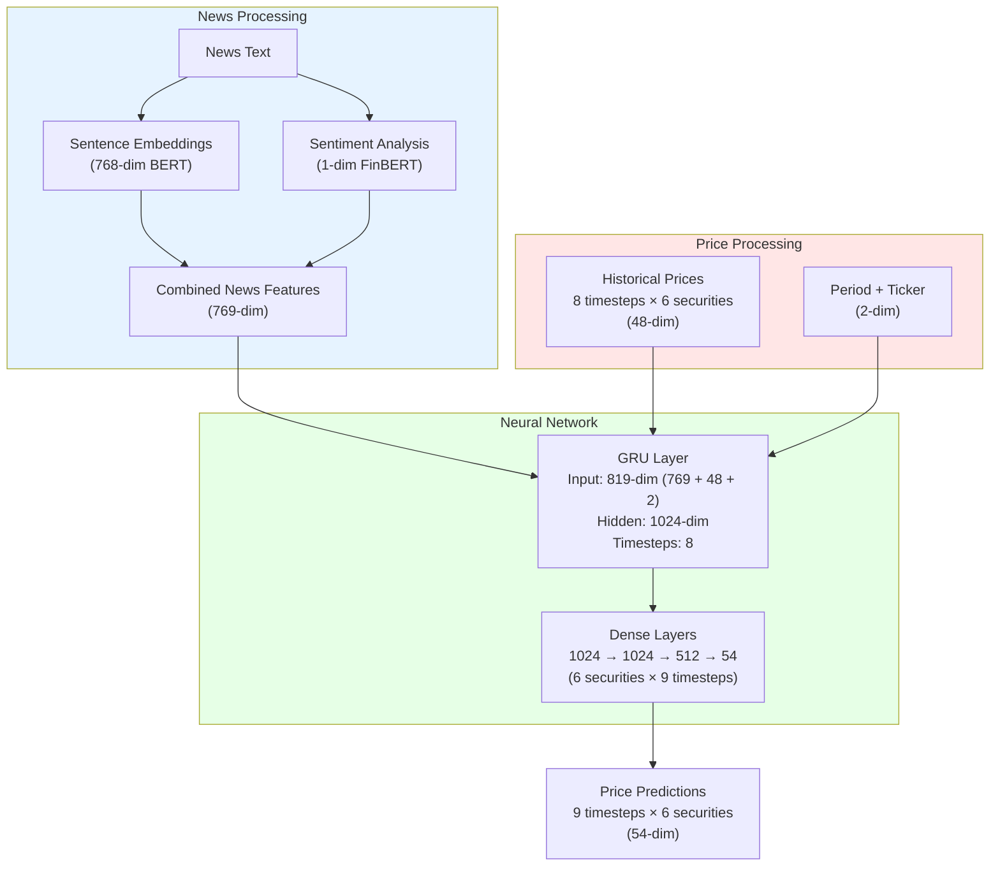

```mermaid
flowchart TB
    subgraph News_Processing ["News Processing"]
        A1["News Text"] --> A2["Sentence Embeddings<br/>(768-dim BERT)"]
        A1 --> A3["Sentiment Analysis<br/>(1-dim FinBERT)"]
        A2 & A3 --> A4["Combined News Features<br/>(769-dim)"]
    end

    subgraph Price_Processing ["Price Processing"]
        B1["Historical Prices<br/>8 timesteps × 6 securities<br/>(48-dim)"]
        B2["Period + Ticker<br/>(2-dim)"]
    end

    subgraph Neural_Network ["Neural Network"]
        direction TB
        C1["GRU Layer<br/>Input: 819-dim (769 + 48 + 2)<br/>Hidden: 1024-dim<br/>Timesteps: 8"]
        C2["Dense Layers<br/>1024 → 1024 → 512 → 54<br/>(6 securities × 9 timesteps)"]
    end

    A4 & B1 & B2 --> C1
    C1 --> C2
    C2 --> D["Price Predictions<br/>9 timesteps × 6 securities<br/>(54-dim)"]

    style News_Processing fill:#e6f3ff
    style Price_Processing fill:#ffe6e6
    style Neural_Network fill:#e6ffe6
```
